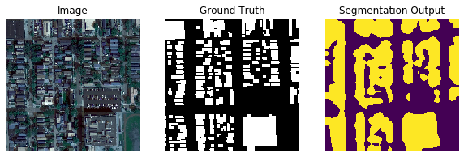
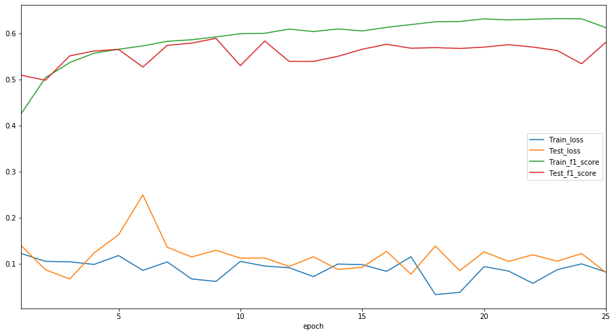

Semantic Segmentation 

This repository contains code for Fine Tuning [DeepLabV3 ResNet101](https://arxiv.org/abs/1706.05587) in PyTorch. The model is from the [torchvision module](https://pytorch.org/docs/stable/torchvision/models.html#semantic-segmentation).


The segmentation output of the model on a sample image are shown below.



To run the code on your dataset use the following command.


Create from a single folder. The structure should be as follows.
```
--data_dir
------Image
---------Image1
---------ImageN
------Mask
---------Mask1
---------MaskN
```

Use this command to create clean data from raw data similar as above
```
python createData.py 
```

Used to train the model and saved it into output folder
```
python main.py ./here/cleanImages ./here/output
```
It has following two optional arguments:
```
--epochs : Specify the number of epochs. Default is 25.
--batchsize: Specify the batch size. Default is 4.
```
The datahandler module has two functions for creating datasets fron single and different folders.

The repository also contains a JupyterLab file with the loss and metric plots as well as the sample prediction code.

